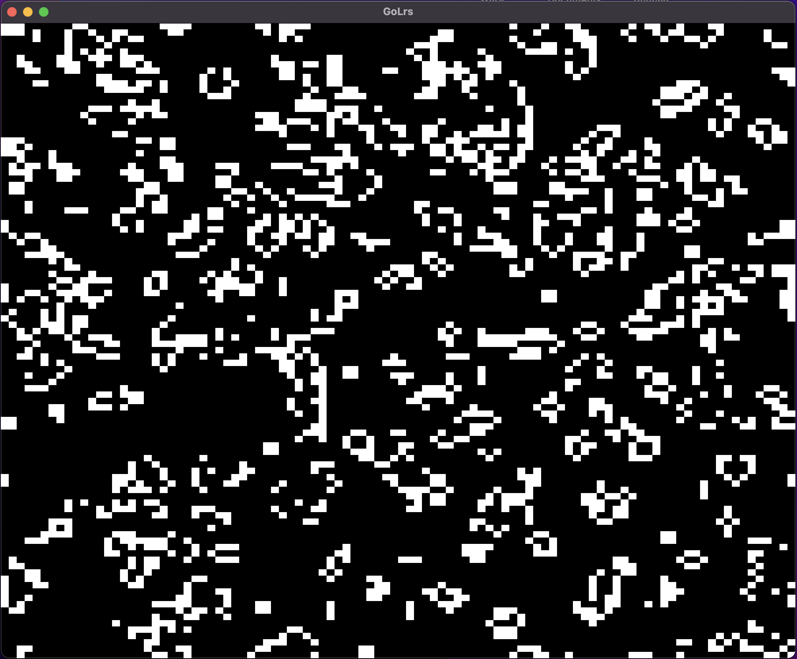

# GoLrs

Game of Life in terminal written in Rust.



## Quick Start

```bash
cargo run
```

## Optional Arguments

```bash
GoLrs (1.0.0) - Interactive Game of Life in terminal

Usage: golrs [OPTIONS]
Options:
  -c, --cols <num>  Number of columns in the board
  -r, --rows <num>  Number of rows in the board
  -h, --help        Print help
  -V, --version     Print version

Iurii Kondrakov <deezzir@gmail.com>
```

## Controls

| Key                                                         | Descritption                   |
|-------------------------------------------------------------|--------------------------------|
| <kbd>w/↑</kbd>,<kbd>s/↓</kbd>,<kbd>a/↓</kbd>,<kbd>d/→</kbd> | Move UP/DOWN/LEFT/RIGHT        |
| <kbd>ENTER</kbd>                                            | Toggle modes Edit/Run          |
| <kbd>SPACE</kbd>                                            | Toggle cell(in Edit Mode)      |
| <kbd>c</kbd>                                                | Clear board(in Edit Mode)      |
| <kbd>r</kbd>                                                | Randomize board(in Edit Mode)  |
| <kbd>q</kbd>,<kbd>CTRL+c</kbd>                              | Quit                           |
